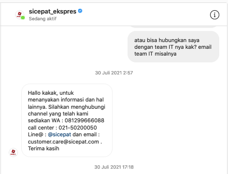

# From Tokopedia to Sicepat.com got leaked (Not Applicable)

## بسم الله الرحمن الرحي


## What is Sicepat.com?

PT **SiCepat Ekspres** adalah perusahaan ekspedisi yang berdiri sejak tahun 2014, dimana pengiriman 15Jam Sampai untuk wilayah Jabodetabek dan Bandung serta pengiriman 1hari Sampai untuk kota besar seluruh wilayah Indonesia merupakan focus utama dalam pelayanannnya.

## What is my report?

Baru-baru ini saya menemukan beberapa celah keamanan yang terdapat pada asset website milik sicepat. ada beberpa celah, akan tetapi kali ini saya akan membahas soal **Information disclosure.**

## Pendahuluan

Berawal dari saya melakukan pembelian di tokopedia.
saya melakukan pengecekan pada pembelian saya di tokopedia


## Proof Of Concept

- BAB I

saya penasaran dengan pengecekan nomor resi. apakah informasi yang ditampilkan pada tokopedia sama seperti yang terdapat pada website sicepat? ternyata sedikit lebih lengkap.

- BAB II

Setelah dilihat-lihat no resi menjadi titik perhatian, saya melakukan pencarian di google tentang no resi sicepat

Banyak sekali no resi yang ditampilkan berupa gambar, berdasarkan informasi yang saya temukan di google, saya melakukan pengecekan no resi yang ditampilkan pada detail transaksi tokopedia, dapat disimpulkan bahwa no resi yang diberikan oleh sicepat berupa kode angka dengan jumlah kode adalah sebanyak 12 angka.


- BAB III

Berdasarkan informasi yang terdapat pada **BAB II**
no resi yang diberikan oleh sicepat mudah ditebak, dikarenakan pola dari no resi yang diberikan auto generate pada kode angka sebelumnya, jadi semisalnya no resi adalah **000112233445** maka kita bisa melakukan pengecekan dengan mengganti pada bagian akhir no resi menjadi **000112233446**, hal ini memungkinkan seseorang yang bukan pemilik no resi dapat melakukan pengecekan no resi orang lain tanpa izin.


Disini saya mencoba melakukan brute force pada no resi sicepat


Dari hasil brute force, saya menemukan hal menarik lainya yaitu ketiga asset lainya milik sicepat

```bash
sicepatresi.s3.amazonaws.com
sicepatmasterdata.s3.amazonaws.com
sicepatmasterdata.s3.ap-southeast-1.amazonaws.com
```
Ternyata pada ketiga asset ini dapat diakses secara publik oleh siapa saja, yang dimana ketiga asset ini menyimpan data informasi berupa alamat lengkap pengirim dan penerima berserta no kontak.


Cemas? yoi dong!, karena saya merupakan salah satu dari sekian banyak pengguna jasa sicepat, sesegara mungkin saya melakukan pelaporan dari hasil temuan saya pada sicepat

Setalah mencari informasi untuk melakukan pelaporan melalui website sicepat.com, untuk kontak pada bagian IT sangat sulit, jadi saya mencoba menghubungi melalui instagram




Saya melakukan pelaporan melalui email yang diberikan


Berdarkan balasan dari CS Sicepat sebagai berikut

```bash
Baik kak, mohon maaf sebelumnya bisa dijelaskan untuk kendala yang dialami terkait pengiriman paketnya kak? Terima kasih
```

Disini saya bisa merasakan bagaimana dramatisnya **Drama Squid Game** yang merupakan film serial Korea Selatan tentang permainan bertahan hidup yang brutal, bisa saya rasakan secara nyata dengan sangat cepat melalui respon **CS sicepat!**


